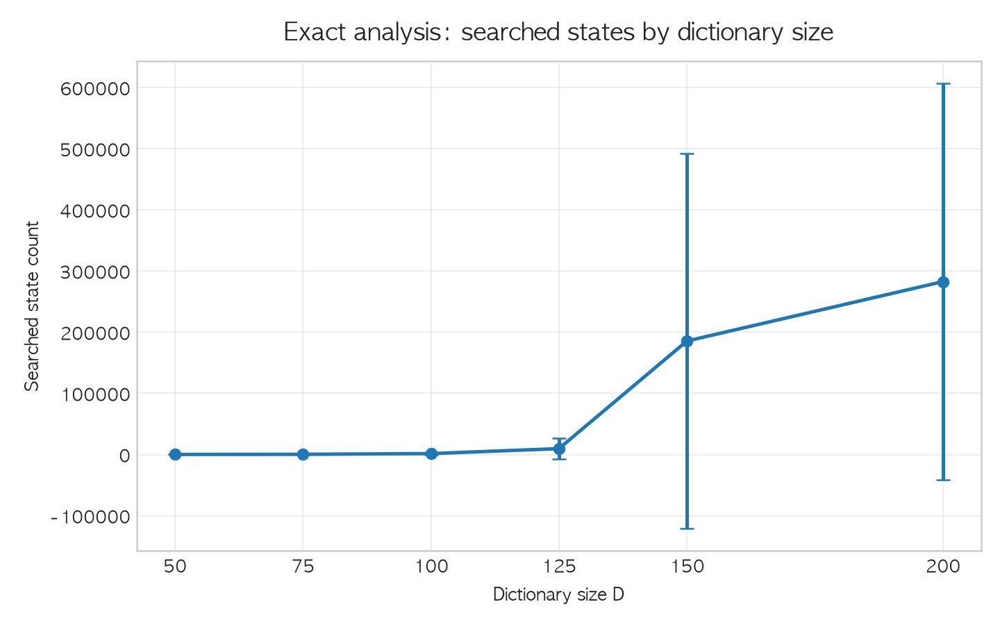
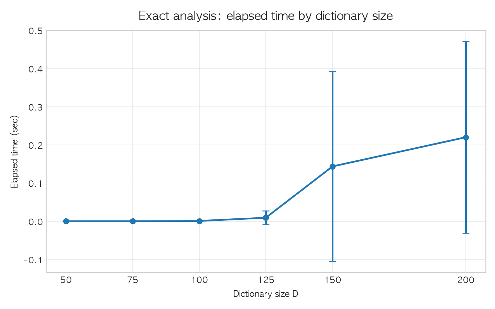
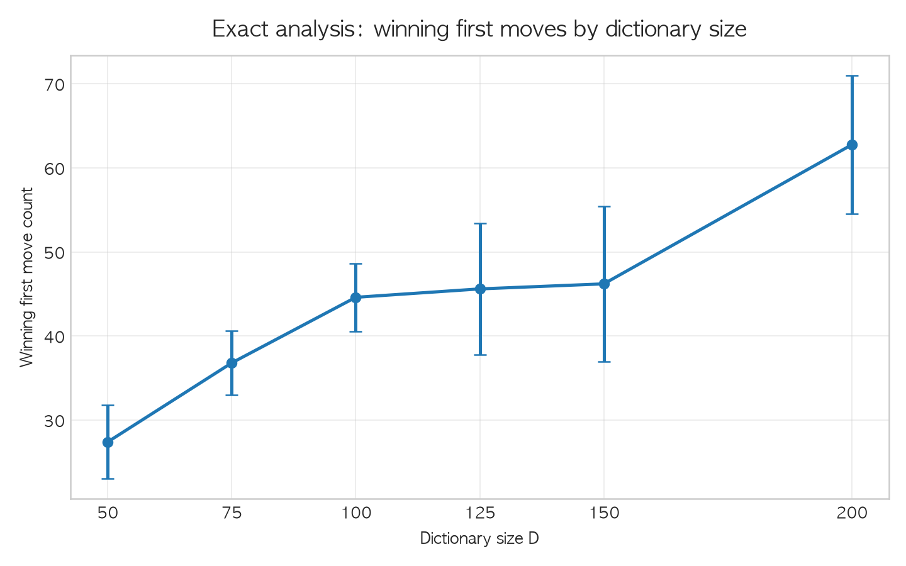
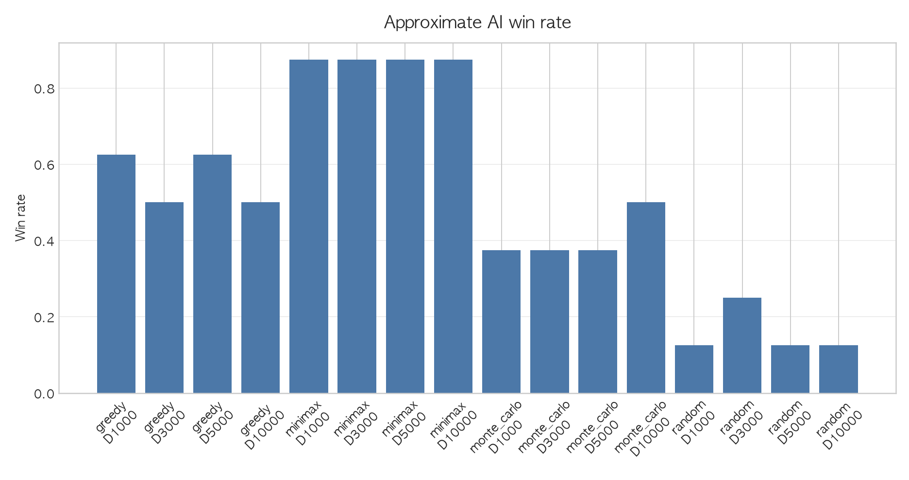

# 有限辞書しりとりにおける単語グラフの勝敗解析

## 1. はじめに

しりとりは日常的な言葉遊びであるが、使用可能な単語を有限集合に制限すると、完全情報ゲームとして扱える。本研究では、しりとりを単語グラフ上の探索問題として定式化し、小規模辞書では勝敗状態と必勝手を完全解析する。また、大規模辞書では完全解析が困難になるため、ランダム、貪欲、深さ制限ミニマックス、モンテカルロ法による近似AIを実装し、勝率と思考時間の関係を分析する。

## 2. 問題設定

本研究では、辞書に含まれる読みだけを使用する有限辞書しりとりを対象とする。同じ読みは1回しか使えず、手番プレイヤーは現在文字から始まる読みを選ぶ。選ばれた読みの末尾文字が次の現在文字になる。「ん」で終わる読みを出した場合、その読みを出したプレイヤーは負ける。また、出せる読みがない場合も負けである。

この設定では、単語を有向辺、文字を頂点とみなすことで、しりとりを有向グラフゲームとして表せる。ただし、同じ単語を再利用できないため、局面は現在文字だけでなく、使用済み単語集合にも依存する。本研究では有限辞書上でのみ解析するため、日本語しりとり全体の完全解を求めるものではない。

## 3. 実装方法

前処理では読み仮名を正規化する。カタカナはひらがなへ変換し、小書き仮名は通常の大きさの仮名へ直す。小さい「っ」は「つ」として扱い、長音「ー」は直前の仮名の母音へ変換する。記号、空白、括弧、アルファベット、数字を含む読みや、正規化後に2文字未満の読みは除外する。同じ読みが複数ある場合は1つに統合する。

正規化後、各読みを1つの単語とみなし、先頭文字と末尾文字を記録する。実装では `words[i]` を読み、`start_chars[i]` を先頭文字、`end_chars[i]` を末尾文字とし、`by_start[start_chars[i]]` に単語番号を保存する。

完全解析では、状態を `current_char` と `used_mask` の組で表す。`used_mask` は使用済み単語集合を表すビットマスクである。`solve(current_char, used_mask)` は、その局面が手番プレイヤーにとって勝ちなら真、負けなら偽を返す。出せる単語がない局面は負けである。末尾が「ん」の単語は、それを出したプレイヤーが負ける手なので、勝ち手として扱わない。合法手の中に、相手を負け状態に送れる手が1つでもあれば勝ち状態とし、どの手でも相手が勝ち状態になる場合は負け状態とする。

## 4. 実験方法

本実験ではJMdictから抽出した読み仮名を使用する。`reb` から読みを取得し、`ke_pri` と `re_pri` から優先度を評価する。高優先度語を中心に候補プールを作り、固定random_seedでD語を抽出することで、JMdict XML上の並び順に依存しない実験用辞書を作る。

実験1では、D20、D30、D50、D75、D100について、seed 0、1、2、3、4の複数辞書を作成し、完全解析で探索状態数、メモサイズ、実行時間、必勝初手数を測定する。辞書サイズごとに平均値と標準偏差も集計する。

実験2では、各単語を初手として固定したときの勝敗を調べる。勝ち手を上位に置き、同じ勝敗なら相手の次の選択肢数が少ない手を上位にする。完全な勝利手数の比較は行わず、相手の選択肢数を補助指標として用いる。

実験3では、各文字について、始まる単語数、終わる単語数、その文字へ相手を送る初手の勝率を集計する。これにより、相手に渡すと有利になりやすい文字を調べる。

実験4では、D1000、D3000、D5000、D10000の大規模辞書で近似AI同士を対戦させる。各AIについて勝率、平均手数、平均思考時間、最大思考時間、タイムアウト回数を記録する。

## 5. 結果

完全解析の実験結果は `results/exact/` 以下に保存する。`exact_runs.csv` には辞書サイズとseedごとの結果を記録し、`exact_summary_by_size.csv` には平均値と標準偏差を記録する。近似AI対戦の結果は `results/approx/` 以下に保存する。`matches.csv` には各対戦、`agent_summary.csv` にはAIごとの集計、`match_logs.jsonl` には手順履歴を記録する。

図は `results/figures/` 以下に保存する。以下の図を本文に挿入する想定である。

表の数値は、実験後に `results/csv/` の値を確認して追記する。

## 6. 考察

辞書サイズが増えると、使用済み単語集合の組合せが増えるため、探索状態数が急増する。特に、同じ文字から始まる単語が多い場合や、文字間に循環が多い場合は、探索する局面数が増えやすい。

候補単語数が多い初手が必ず強いとは限らない。しりとりでは、自分がどの文字へ相手を送るか、またその単語を消費することで後続局面がどう変わるかが重要である。相手を選択肢の少ない文字に送る単語は有利になりやすいが、単純な出次数だけでは勝敗を完全には説明できない。

本研究の結果は使用した有限辞書に依存する。そのため、日本語全体への一般化には注意が必要である。それでも、しりとりをグラフゲームとして定式化し、探索によって勝敗状態を求めることには意味がある。

## 7. まとめ

有限辞書上のしりとりを完全情報ゲームとして定式化し、メモ化再帰により勝敗解析を行うAIを実装した。小規模辞書では完全解析により必勝初手を求められた。一方で、辞書サイズの増加に伴い探索状態数と実行時間が増加し、しりとりにおいても組合せ爆発が生じることを確認した。

## 8. 参考文献

- JMdict / EDRDG. JMdict Japanese-Multilingual Dictionary File. `http://ftp.edrdg.org/pub/Nihongo/JMdict_e.gz`
- EDRDG License Statement. `https://www.edrdg.org/edrdg/licence.html`
- ゲーム木探索、ミニマックス法に関する文献。詳細は後で追記する。
- メモ化再帰、動的計画法に関する文献。詳細は後で追記する。
- 有向グラフとグラフゲームに関する文献。詳細は後で追記する。
